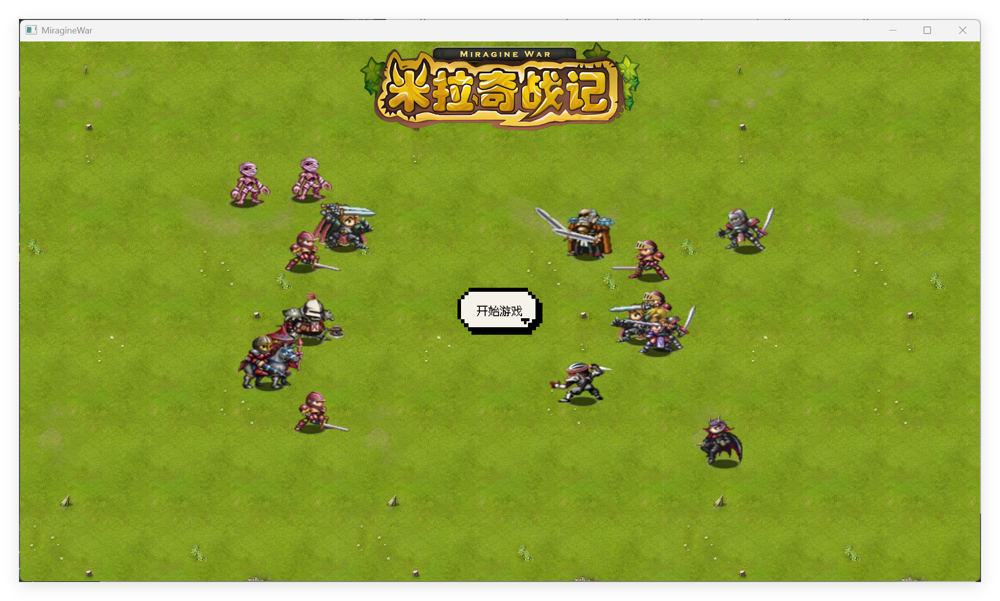

# 米拉奇战记 MiragineWar 
## 前言
> 写给我小有遗憾的童年

《米拉奇战记》是一款双人对战即时战略游戏，我最早接触它时那还是一个Flash遍地的年代，自Flash被抛弃后便仅有[oldswf](https://oldswf.com/game/83070)这处秘境能让我简单地回到过去。互联网是个好东西，因为再也没有小伙伴到我家里来抢夺字母键了，于是我便开启了本项目，期待网络上能够和他们再次见面。  
## 简述
本项目是对米拉奇战记的再实现，并在其上添加了网络匹配对战功能，其余玩法一切照旧。
### 基础环境
两端基础层全部通过`MinGW64`支持的`C++17`实现，由[`sol2`](https://github.com/ThePhD/sol2/)库搭建脚本层嵌入[`Lua`](https://www.lua.org/)编写逻辑，使用[`TOML`](https://toml.io/)语言和`Lua`书写配置文件。逻辑架构基于ECS设计并向上抽象，通过小有修剪的[`SLikeNet`](https://github.com/ChaseOne1/SLikeNet)库实现网络通信，使用[`mathfu`](https://github.com/google/mathfu)库做数学支持，由[`spdlog`](https://github.com/gabime/spdlog)库提供日志服务，感谢[`mirrow`](https://github.com/VisualGMQ/mirrow/)库的反射支持。

不依赖任何游戏引擎。
### 客户端
游戏客户端通过[SDL3](https://wiki.libsdl.org/SDL3/FrontPage)及其衍生库完成平台支持和视听表现，原始美术资源来自于抓取解包，开发有完整的工具集用以处理和管理资产。支持资源和脚本的热更新。
### 服务端
游戏服务端应用了单进程多线程的模型，支持承载多个游戏对局，支持数据和逻辑的热更新。
## 构建
示例环境：`PowerShell 7`，`g++.exe (x86_64-win32-seh-rev1, Built by MinGW-Builds project) 13.2.0`，`CMake version 4.0.3`，`Lua 5.4`
* 选择至少支持C++17的MinGW64工具集和至少`CMake 3.2.0`以上版本
* 构建命令语法请根据所在命令行环境适当调整

示例平台：Windows 11
* 平台为至少为SDL3所[支持的平台](https://wiki.libsdl.org/SDL3/README-platforms)
### 客户端
1. 克隆本仓库并初始化
```shell
git clone --depth 1 https://github.com/ChaseOne1/MiragineWar.git
cd MiragineWar && ./scripts/configure.ps1
```
2. 构建并编译
```shell
mkdir build && cd build
# change the value of 'LUA_ROOT' to your lua dev directory
cmake .. -G 'MinGW Makefiles' -DLUA_ROOT=E:\\lua 
cmake --build . -j 4
```
3. 从Release页面下载游戏资源，并移动到`bin`目录下，现在你的游戏二进制目录布局应如：
```shell
> ls

Mode                 LastWriteTime         Length Name
----                 -------------         ------ ----
d----           2025/8/12     5:23                Assets
-a---           2025/8/10     3:49            275 language_cn.toml
-a---           2025/7/31    21:37        3057121 libSLikeNetDLL.dll
-a---          2025/11/30    16:52       96075965 MiragineWar.exe
-a---            2025/8/1     2:05         337871 SDL3_image.dll
-a---            2025/8/1     2:05       10794202 SDL3_ttf.dll
-a---            2025/8/1     2:05        4955975 SDL3.dll
-a---            2025/8/8    22:03            632 settings.toml
```
### 服务端
1. 克隆服务端仓库
```shell
mkdir MiragineWarServer && cd MiragineWarServer
git clone --recursive --depth 1 https://github.com/ChaseOne1/MiragineWarServer.git
```
2. 使用`CMake`编译
```shell
mkdir build && cd build
cmake .. -G 'MinGW Makefiles'
cmake --build . -j 4
```
3. 现在你的游戏二进制目录`MiragineWar-Server`布局应如：
```shell
> ls

Mode                 LastWriteTime         Length Name
----                 -------------         ------ ----
-a---            2025/8/3    18:05        1530496 libSLikeNetDLL.dll
-a---          2025/11/30    16:57          11478 log.txt
-a---            2025/8/9    18:30       25889466 MiragineWarServer.exe
-a---            2025/8/3    18:10             65 settings.toml
```
## 运行
1. 启动服务端，运行`MiragineWar-Server/MiragineWarServer.exe`
，能够看到进程输出形如：
```shell
[info](Network.cc:19): Waiting for connections
[info](Worker.cc:18): Thread 17960 begining
```
2. 启动客户端，打开`bin/MiragineWar.exe`，能够看到游戏窗口：

3. 点击开始游戏，等待匹配对手。

## 其他
更多功能持续开发中...
